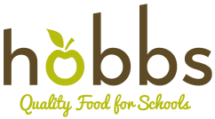

# Hobbs Catering - School Meal Ordering System

A modern, mobile-first web application for parents to pre-order school lunches, manage student dietary profiles with dynamic allergen conflict detection, and complete offline BACS bank transfer checkouts.



---

## 🌟 Key Features

- **Auth & Multi-step Onboarding**: Captures parent details, student profiles, Halal requirements, and allergen checklists.
- **Dynamic Allergen & Halal Engine**: Compares dish ingredients against student dietary profiles, rendering clear warning tags (e.g. *Contains Wheat, Milk - Conflict with Alex's Allergies*).
- **Interactive Daily & Weekly Ordering**: Horizontal day picker (Sep 3 – Oct 23, 2026) and 8-week overview grid.
- **Offline BACS Checkout**: Aggregated basket breakdown, unique reference code generator (`HOBBS-XXXXXX`), Hobbs business account details, and `pending_transfer` status tracking.
- **Order History & Receipts**: Itemized order receipts and payment status badges.
- **Supabase Integration (`hobbs` schema)**: Database schema migration and master menu seed data included.

---

## 🚀 Getting Started

### Prerequisites

- Node.js 18+
- npm / yarn / pnpm

### Installation

```bash
# Install dependencies
npm install

# Start development server
npm run dev

# Build for production
npm run build
```

---

## 🗄️ Database Setup (`hobbs.*`)

Run the SQL migration in `supabase/migrations/01_hobbs_schema.sql` on your Supabase PostgreSQL database to create tables under the `hobbs` schema and seed all 36 school days of daily menus.

---

## 🔒 Environment Variables

Configure `.env.local`:

```env
VITE_SUPABASE_URL=https://supabase.gravonlabs.com
VITE_SUPABASE_ANON_KEY=your_anon_key
VITE_SUPABASE_SCHEMA=hobbs
```
